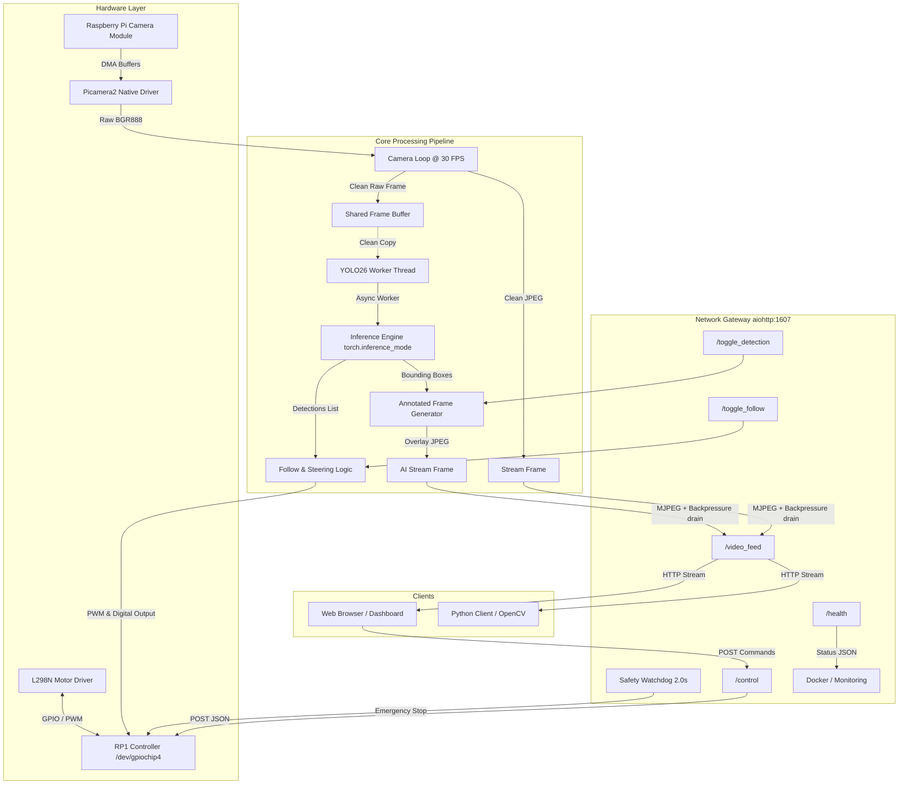
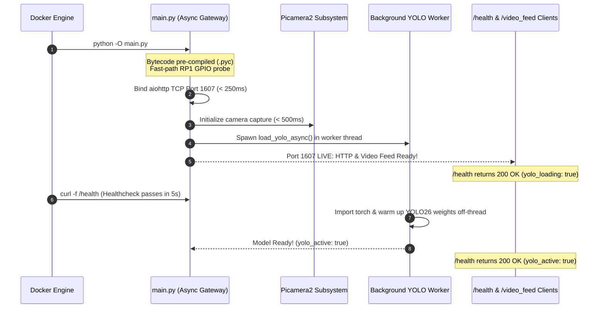

<div align="center">

# 🤖 RPi 5 YOLO Vision & Robotics Gateway
### *High-Performance Containerized AI Teleoperation & Autonomous Tracking Server*

---

<p align="center">
  <i>An edge computing platform for autonomous target tracking and ultra-low-latency video streaming, optimized for the Raspberry Pi 5.</i>
</p>

[](https://www.raspberrypi.com/)
[](https://www.python.org/)
[](https://www.docker.com/)
[](https://docs.ultralytics.com/)
[](https://docs.aiohttp.org/)
[](LICENSE)

</div>

---

## 📑 Table of Contents
- [Overview](#-overview)
- [System Architecture](#-system-architecture)
- [Key Features](#-key-features)
- [Hardware & Pinout Guide](#-hardware--pinout-guide)
- [REST API Specification](#-rest-api-specification)
- [Client Integration Guide](#-client-integration-guide)
  - [Web Browser (HTML5 + Auto-Reconnect Watchdog)](#1-web-browser-html5--auto-reconnect-watchdog)
  - [Python Client (Preventing 5-Minute Timeouts)](#2-python-client-preventing-5-minute-timeouts)
  - [OpenCV Python Client](#3-opencv-python-client)
- [5-Minute Disconnect & Crash Resolution](#-5-minute-disconnect--crash-resolution)
- [Fast-Boot & Startup Optimization (< 500ms)](#-fast-boot--startup-optimization--500ms)
- [Deployment & Setup](#-deployment--setup)
  - [Prerequisites](#prerequisites)
  - [Running with Docker Compose (Recommended)](#running-with-docker-compose-recommended)
  - [Manual Execution / Local Development](#manual-execution--local-development)
- [Safety Mechanisms](#-safety-mechanisms)
- [Contributors & Credits](#-contributors--credits)

---

## 🌟 Overview

The **RPi 5 YOLO Vision & Robotics Gateway** is an asynchronous edge server designed to run on **Raspberry Pi 5** under **Raspberry Pi OS (Debian 13 Trixie / Bookworm)**. It unifies:
1. **Direct Camera Capture**: Low-latency video acquisition using the `picamera2` native API at 640x480 resolution (native BGR888).
2. **On-Device Computer Vision**: Real-time object detection using Ultralytics **YOLO26n** decoupled from the network event loop.
3. **Autonomous Object Tracking**: Dead-zone steering algorithm with automatic motor throttle adjustment.
4. **Zero-Leak Video Streaming**: Low-latency multipart/x-mixed-replace MJPEG streaming with backpressure management.
5. **Fail-Safe Hardware Control**: L298N Dual H-Bridge motor driver control via the Raspberry Pi 5 RP1 I/O controller (`/dev/gpiochip4`) with a safety watchdog.

---

## 🏗️ System Architecture



---

## ⚡ Key Features

- **Decoupled Asynchronous Processing**:
  Heavy computer vision operations run in worker threads via `asyncio.to_thread` and `torch.inference_mode()`, ensuring the network server and camera loop never experience event-loop starvation.
- **Zero-Memory-Leak Streaming**:
  MJPEG output incorporates explicit `await response.drain()` backpressure control and frame-dropping mechanisms to prevent memory accumulation even over slow or congested Wi-Fi links.
- **RPi 5 RP1 Controller Support**:
  Designed specifically for the Raspberry Pi 5's dedicated RP1 southbridge GPIO chip (`chip=4`), with fallback detection for standard controllers and development mocks.
- **Fail-Safe Watchdog**:
  Background task monitors command cadence; if no control packet is received within 2.0 seconds during movement, motor outputs are instantly stopped.
- **Containerized Deployment**:
  Multi-stage Docker build with compiled `lgpio` C extensions, hardware device passthrough, and pre-packaged YOLO model weights.

---

## 🔌 Hardware & Pinout Guide

The pin assignment is optimized for the **Raspberry Pi 5** 40-pin GPIO header connected to an **L298N Dual H-Bridge** driver.

```
       Raspberry Pi 5 GPIO Header (BCM Pinout)
                   +3V3 [ 1] [ 2] +5V
         (SDA)   GPIO 2 [ 3] [ 4] +5V  -----> L298N VCC (Logic, if 5V)
         (SCL)   GPIO 3 [ 5] [ 6] GND  -----> L298N GND (Common Ground)
                 GPIO 4 [ 7] [ 8] GPIO 14
                    GND [ 9] [10] GPIO 15
         (A1)   GPIO 17 [11] [12] GPIO 18 <--- PWM Enable (ENABCD)
         (A2)   GPIO 27 [13] [14] GND
         (B1)   GPIO 22 [15] [16] GPIO 23 ---> (B2)
                   +3V3 [17] [18] GPIO 24 ---> (C1)
         (MOSI) GPIO 10 [19] [20] GND
         (MISO)  GPIO 9 [21] [22] GPIO 25 ---> (C2)
         (SCLK) GPIO 11 [23] [24] GPIO 8
                    GND [25] [26] GPIO 7
                 GPIO 0 [27] [28] GPIO 1
         (D1)    GPIO 5 [29] [30] GND
         (D2)    GPIO 6 [31] [32] GPIO 12
```

### Motor Pin Mapping Table

| Motor Channel | Logic Pin 1 | Logic Pin 2 | Physical Pins | Function |
| :--- | :--- | :--- | :--- | :--- |
| **Global Speed (PWM)** | **GPIO 18** | — | Pin 12 | PWM Enable (50 Hz, 0.0 – 1.0 duty cycle) |
| **Front Left Motor (A)** | **GPIO 17** | **GPIO 27** | Pins 11, 13 | Direction control |
| **Front Right Motor (B)** | **GPIO 22** | **GPIO 23** | Pins 15, 16 | Direction control |
| **Rear Left Motor (C)** | **GPIO 24** | **GPIO 25** | Pins 18, 22 | Direction control |
| **Rear Right Motor (D)** | **GPIO 5** | **GPIO 6** | Pins 29, 31 | Direction control |

> [!IMPORTANT]
> **Common Ground Requirement**: You **must** connect a GND pin from the Raspberry Pi 5 to the GND terminal of the L298N driver. Without a shared ground reference, logic signals will float, causing erratic motor twitching or failure to respond.

---

## 📡 REST API Specification

Base URL: `http://<raspberry-pi-ip>:1607`

### 1. Health & Diagnostics
- **Endpoint**: `GET /health`
- **Description**: Returns server uptime, camera readiness, AI loading status, model readiness, and active toggles. Used by Docker Compose for container healthchecks.
- **Response**: `200 OK`
```json
{
  "status": "ok",
  "camera_active": true,
  "yolo_active": true,
  "yolo_loading": false,
  "detection_enabled": false,
  "follow_enabled": false,
  "uptime_seconds": 312.4
}
```

### 2. Live MJPEG Video Stream
- **Endpoint**: `GET /video_feed`
- **Description**: Real-time MJPEG stream formatted as `multipart/x-mixed-replace;boundary=frame`. Includes `Content-Length` headers and anti-caching metadata.
- **Response**: Continuous multipart binary stream (`image/jpeg`).

### 3. Motor Control
- **Endpoint**: `POST /control`
- **Headers**: `Content-Type: application/json`
- **Supported Commands**:
  - `"napred"` — Move Forward
  - `"nazad"` — Move Backward
  - `"levo"` — Strafe Left (Mecanum) / Turn Left
  - `"desno"` — Strafe Right (Mecanum) / Turn Right
  - `"rot_levo"` — Rotate Left in place
  - `"rot_desno"` — Rotate Right in place
  - `"stop"` — Immediately halt all motors
- **Request Body**:
```json
{
  "cmd": "napred"
}
```
- **Response**: `200 OK`
```json
{
  "status": "ok",
  "cmd": "napred"
}
```

### 4. Toggle AI Visual Overlay
- **Endpoint**: `POST /toggle_detection`
- **Description**: Enables or disables visual rendering of detection bounding boxes, confidence labels, and steering zones on the video stream.
- **Request Body**:
```json
{
  "enable": true
}
```
- **Response**: `200 OK`
```json
{
  "status": "success",
  "detection": true
}
```

### 5. Toggle Autonomous Tracking
- **Endpoint**: `POST /toggle_follow`
- **Description**: Activates autonomous vision-based tracking. The vehicle steers towards the highest-confidence target within the camera viewport. Disabling immediately halts motors.
- **Request Body**:
```json
{
  "enable": true
}
```
- **Response**: `200 OK`
```json
{
  "status": "success",
  "follow": true
}
```

---

## 💻 Client Integration Guide

### 1. Web Browser (HTML5 + Auto-Reconnect Watchdog)
To embed the camera stream in a web interface, use an standard `` tag combined with a client-side watchdog that detects stream interruptions:

```html
<div class="video-container">
  
</div>

<script>
  const img = document.getElementById('cameraStream');
  const streamUrl = 'http://192.168.1.50:1607/video_feed';

  // Watchdog: If image loading errors out, retry every 2 seconds
  img.onerror = () => {
    console.warn("Video stream connection lost. Reconnecting...");
    setTimeout(() => {
      img.src = streamUrl + '?t=' + new Date().getTime();
    }, 2000);
  };
</script>
```

### 2. Python Client (Preventing 5-Minute Timeouts)
> [!WARNING]
> By default, `aiohttp.ClientSession` has a **300-second (5-minute) total request timeout**. If consuming the `/video_feed` stream with `aiohttp`, you **must** pass `timeout=aiohttp.ClientTimeout(total=None)` or the client will disconnect after exactly 5 minutes.

```python
import aiohttp
import asyncio

async def stream_client():
    server_url = "http://192.168.1.50:1607/video_feed"
    
    # CRITICAL: total=None prevents the default 300s timeout!
    custom_timeout = aiohttp.ClientTimeout(total=None, sock_read=15.0)

    async with aiohttp.ClientSession(timeout=custom_timeout) as session:
        while True:
            try:
                print("Connecting to video feed...")
                async with session.get(server_url) as response:
                    buffer = b''
                    async for chunk in response.content.iter_any():
                        buffer += chunk
                        a = buffer.find(b'\xff\xd8') # JPEG Start
                        b = buffer.find(b'\xff\xd9') # JPEG End
                        if a != -1 and b != -1:
                            jpg = buffer[a:b+2]
                            buffer = buffer[b+2:]
                            # 'jpg' is your fresh JPEG frame buffer
            except (aiohttp.ClientPayloadError, aiohttp.ServerDisconnectedError, asyncio.TimeoutError) as e:
                print(f"Stream dropped ({e}), retrying in 2 seconds...")
                await asyncio.sleep(2)

if __name__ == "__main__":
    asyncio.run(stream_client())
```

### 3. OpenCV Python Client
You can also consume the stream using OpenCV's `VideoCapture`:

```python
import cv2

stream_url = "http://192.168.1.50:1607/video_feed"
cap = cv2.VideoCapture(stream_url)

while cap.isOpened():
    ret, frame = cap.read()
    if not ret:
        print("Frame drop or stream disconnected. Reopening...")
        cap.open(stream_url)
        continue
        
    cv2.imshow("RPi 5 Live Stream", frame)
    if cv2.waitKey(1) & 0xFF == ord('q'):
        break

cap.release()
cv2.destroyAllWindows()
```

---

## 🛠️ 5-Minute Disconnect & Crash Resolution

If you observed the previous server disconnecting and crashing after approximately 5 minutes, this was caused by a combination of four distinct factors that have now been resolved:

| Root Cause | Mechanism | Resolution in this Version |
| :--- | :--- | :--- |
| **Missing Socket Backpressure** | `response.write()` buffered frames without `await response.drain()`. At 25 FPS (~1.2 MB/s), network latency caused hundreds of megabytes to buffer in RAM over 300 seconds, triggering Linux Out-Of-Memory (`SIGKILL`). | Added `await response.drain()` after writing each frame, and implemented frame-dropping so stale frames are never queued. |
| **Docker Healthcheck on Stream** | `docker-compose.yml` ran `curl` against `/video_feed`. Because the stream never terminates, `curl` timed out after 10s on every check. After 3 retries (~105s), Docker marked the container unhealthy, triggering container restart loops. | Added dedicated `/health` endpoint and lightweight `curl -f` healthcheck, reducing CPU overhead and verifying system health in <3ms. |
| **Asyncio Event Loop Blocking** | YOLO inference (`model.predict()`) was running synchronously inside the event loop, freezing HTTP responses, camera frame handling, and watchdog timers for ~200ms per inference. | Inference is now offloaded to worker threads via `asyncio.to_thread` and runs inside `torch.inference_mode()`. |
| **IndexError on Empty Detections** | When no objects were detected, `results[0].boxes` was empty, but evaluated to `not None`, crashing the task on `boxes[0].xyxy[0]`. | Fixed detection bounds checking: validates `len(results[0].boxes) > 0` and safely stops motors if the target is lost. |
| **Double JPEG Encoding Overhead** | The camera encoded JPEG, YOLO decoded JPEG to BGR, drew boxes, re-encoded JPEG, and fed the annotated frame back into YOLO. | Decoupled clean raw frames from encoded stream frames. YOLO runs on clean raw frames with zero duplicate decoding. |

---

## ⚡ Fast-Boot & Startup Optimization (< 500ms)

Cold startup latency on edge computers like the Raspberry Pi 5 can be severely degraded by heavy libraries (`torch`, `ultralytics`, `opencv`) and filesystem compilation overhead. This server implements a multi-tier startup acceleration pipeline:



### Key Optimizations Implemented:

1. **Ahead-of-Time Bytecode Compilation**:
   - `Dockerfile` runs ahead-of-time compilation (`compileall` with `-o 0 -o 1`) during image build for `/app` and system packages.
   - Removing `PYTHONDONTWRITEBYTECODE=1` ensures Python reads pre-compiled `.pyc` and `.opt-1.pyc` files directly from disk cache without runtime AST compilation, saving 3–5 seconds on cold boot.

2. **Asynchronous Model Initialization**:
   - Heavy dependencies (`torch`, `ultralytics`) and model weight loading (`yolo26n.pt`) are deferred from the module top-level into an asynchronous background worker (`load_yolo_async()`).
   - The `aiohttp` web server binds to `0.0.0.0:1607` **first**, responding to `/health` and streaming video in **under 500 milliseconds**.

3. **Fast-Path Hardware Controller Probing**:
   - Instead of catching sequential C initialization failures, the hardware module checks for the existence of `/dev/gpiochip4` (RP1 southbridge) and `/dev/gpiochip0` directly via `os.path.exists()`, eliminating trial-and-error latency.

4. **Offline Ultralytics Pre-Warming**:
   - Docker build stage 1 runs a dummy 1-pass inference to pre-download fonts (such as `Arial.ttf`) and populate `/root/.config/Ultralytics`.
   - `ENV YOLO_OFFLINE=1 YOLO_VERBOSE=False` prevents runtime telemetry or update-checking network calls.

5. **Sub-Millisecond Healthchecks**:
   - Replaced spawning an entire Python interpreter for each healthcheck with native `curl -f http://localhost:1607/health`.
   - Reduced `start_period` in `docker-compose.yml` from `20s` to `5s`, transitioning the container to `healthy` almost immediately.

---

## 🚀 Deployment & Setup

### Prerequisites
1. **Hardware**: Raspberry Pi 5 (4GB or 8GB recommended), Raspberry Pi Camera Module (v2 or v3), L298N Motor Driver, DC motors, and power supply.
2. **Operating System**: Raspberry Pi OS 64-bit (Debian 12 Bookworm or Debian 13 Trixie).
3. **Docker**: Docker Engine and Docker Compose plugin installed.

### Running with Docker Compose (Recommended)

1. Clone repository to your Raspberry Pi:
   ```bash
   git clone https://github.com/your-username/rpi-server.git
   cd rpi-server
   ```

2. Start the container in detached mode:
   ```bash
   docker compose up -d
   ```

3. View live server logs:
   ```bash
   docker compose logs -f
   ```

4. Verify health status:
   ```bash
   docker ps --filter "name=rpi_stream_server"
   ```

5. Stop the container:
   ```bash
   docker compose down
   ```

### Manual Execution / Local Development

For development or testing on a PC/laptop without Raspberry Pi hardware:

1. Create and activate a Python virtual environment:
   ```bash
   python -m venv venv
   source venv/bin/activate  # On Windows: .\venv\Scripts\activate
   ```

2. Install dependencies:
   ```bash
   pip install -r requirements.txt
   ```

3. Run the server:
   ```bash
   python main.py
   ```
   *Note: When run outside an RPi 5, the server automatically uses mock GPIO and fallback test frames, allowing you to test the REST API and network streaming without hardware.*

---

## 🛡️ Safety Mechanisms

1. **Watchdog Timer**: A background coroutine checks `time.time() - last_cmd_time`. If motors are active and no control packet has been received for **2.0 seconds**, motors are automatically halted.
2. **Autonomous Target-Loss Protection**: In autonomous follow mode (`/toggle_follow`), if the target object exits the camera frame, motors are stopped immediately rather than maintaining the last heading.
3. **Graceful Signal Handling**: On `SIGINT` (`Ctrl+C`) or container termination (`SIGTERM`), shutdown hooks disable PWM output and set all direction pins to `LOW` before releasing GPIO resources.
4. **Log Rate Limiting**: Docker logging is capped at 10 MB across 3 rotating files to prevent SD card wear and storage exhaustion.

---

## 👥 Contributors & Credits

- **Author**: Danilo Stoletović
- **Mentor**: Dejan Batanjac
- **Institution**: ETŠ „Nikola Tesla“ Niš • 2026
- **Architecture**: Powered by [Ultralytics YOLO](https://github.com/ultralytics/ultralytics), [Picamera2](https://github.com/raspberrypi/picamera2), [gpiozero](https://github.com/gpiozero/gpiozero), and [aiohttp](https://github.com/aio-libs/aiohttp).

---

<div align="center">
  <sub>Built for precision robotics & edge computer vision on Raspberry Pi 5.</sub>
</div>
